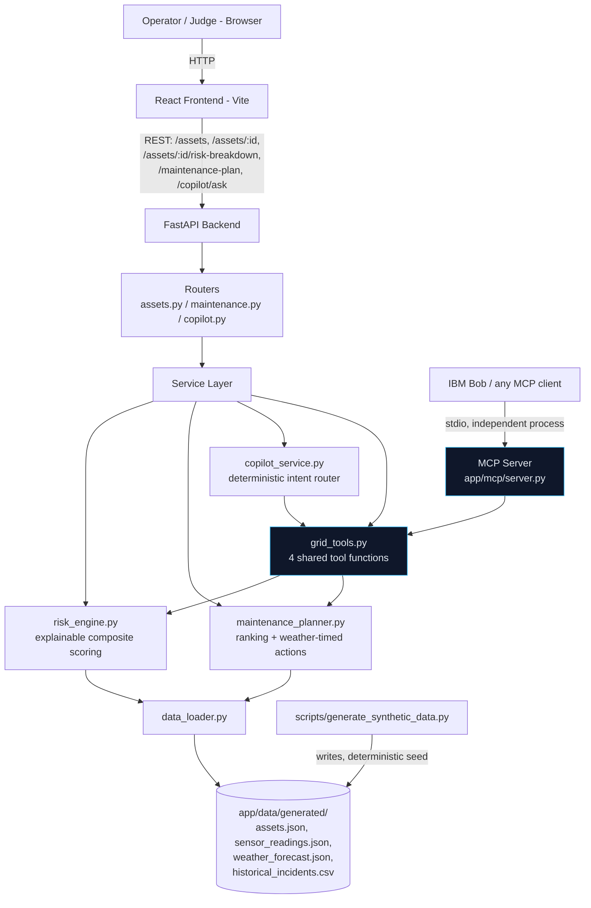

# Architecture

## System Architecture



**The one decision that matters most in this diagram:** `copilot_service.py`
(used by the web app's `/copilot/ask`) and `app/mcp/server.py` (used by IBM
Bob / any MCP client) both call into `grid_tools.py` — there is exactly one
implementation of "what counts as at-risk," not a UI version and a separate
Bob-demo version.

## Components

| Component | Technology | Responsibility |
|---|---|---|
| Frontend | React 19 + Vite + TypeScript + Tailwind CSS v4 + Recharts | Dashboard, asset detail, maintenance plan, Grid Copilot chat UI |
| Backend API | FastAPI + Uvicorn | REST endpoints, request validation (Pydantic), CORS |
| Risk Engine | Python (statistics module, no ML training) | Explainable composite risk scoring: sensor anomaly + weather risk + historical incident rate |
| Maintenance Planner | Python | Ranks by `risk_score × grid_impact_severity`, groups by region, times recommendations against weather forecasts |
| Grid Tools | Python | The 4 tool functions shared by the Copilot and the MCP server |
| Grid Copilot | Python (deterministic keyword/intent router) | Answers natural-language questions using real tool calls; zero dependency on a live LLM key |
| MCP Server | Python `mcp` SDK (`FastMCP`) | Exposes `get_at_risk_assets`, `get_asset_detail`, `explain_asset_risk`, `get_maintenance_plan`, `list_regions` to IBM Bob / any MCP client |
| Data Store | JSON/CSV files, loaded into memory at startup | Zero infrastructure, fully reproducible from a committed, re-runnable generator |
| Synthetic Data Generator | Python (stdlib only, seeded) | Deterministically produces internally-consistent assets, 30-day sensor series, 7-day weather forecasts, and historical incidents |

## Data Flow

1. `scripts/generate_synthetic_data.py` runs (once, or any time you want fresh
   data) and writes `assets.json`, `sensor_readings.json`,
   `weather_forecast.json`, and `historical_incidents.csv` under
   `src/backend/app/data/generated/`. It is seeded (`random.seed(42)`), so the
   same run always reproduces the same narrative: the top-ranked asset always
   has both a genuinely degrading sensor trend and an upcoming storm in its
   region.
2. On FastAPI startup, `data_loader.py` reads all four files into memory once
   (`@lru_cache`) and fails fast with a clear error if the data hasn't been
   generated yet.
3. `risk_engine.py` computes, per asset: a sensor anomaly score per metric
   (z-score-style deviation of the last 3 days vs. that asset's own 15-day
   baseline, direction-aware), a weather risk term (full weight if a storm is
   forecast for the asset's region within 7 days), and a historical incident
   rate term (from the asset's age/type bracket) — summed into one 0-100
   score with every component individually returned for the "Why This Score"
   UI.
4. `maintenance_planner.py` ranks assets by `risk_score × grid_impact_severity`,
   groups the top N by region, and pulls each recommendation's target date
   forward to land before a forecast storm in that region.
5. The React frontend calls `/assets`, `/assets/:id`, `/assets/:id/risk-breakdown`,
   and `/maintenance-plan` to render the dashboard, asset detail, and
   maintenance plan views.
6. The Grid Copilot sends a question to `POST /copilot/ask`;
   `copilot_service.py` matches intent (region / asset / maintenance / risk
   keywords) and calls the matching function(s) in `grid_tools.py`, returning
   a grounded answer plus the list of tool calls that produced it — shown
   transparently in the UI.
7. Independently of the web app, `python -m app.mcp.server` starts an MCP
   server over stdio exposing the same `grid_tools.py` functions — see
   **Verifying the Bob/MCP integration** below.

## Verifying the Bob/MCP Integration

This is the concrete, judge-reproducible proof that IBM Bob integration is
load-bearing rather than name-dropped:

```bash
cd src/backend
.venv/Scripts/activate            # or source .venv/bin/activate
python -m app.mcp.server          # starts an MCP server over stdio
```

Connect any MCP client (or IBM Bob's MCP tool-calling) to this process and
call, for example:

```
get_at_risk_assets(region="Eastgate", min_tier="High", limit=3)
```

The returned `risk_score` values will exactly match what the dashboard shows
for those same assets in that region at `http://localhost:5173`, because both
paths call the same `app/services/grid_tools.py` functions. As a quick
sanity check without a full MCP client, the same guarantee can be verified
directly in Python:

```bash
python -c "
import asyncio
from app.mcp.server import mcp
print(asyncio.run(mcp.call_tool('get_at_risk_assets', {'region': 'Eastgate', 'min_tier': 'High', 'limit': 3})))
"
```

## Security Considerations

- All data is synthetic — no real customer, PII, or utility operational data
  anywhere in the repository.
- `.env` is git-ignored in both `src/backend/` and `src/frontend/`; only
  `.env.example` (no real values) is committed.
- No secrets are required for the MVP to run at all — the Grid Copilot's
  deterministic router needs no LLM API key. If one is ever added, it is read
  from an environment variable only, never hardcoded.
- CORS is restricted to the known frontend dev origin(s), not wildcarded.
- No authentication/authorization layer exists — explicitly out of scope for
  this MVP and listed in `known_limitations`; not appropriate to fake for a
  demo that has no real user accounts or sensitive data.

## Scalability Notes

The FastAPI backend is stateless per request and would scale horizontally
behind a load balancer without any code changes. The current bottleneck for
scale is the in-memory JSON data store and the fact that `risk_engine.py`
recomputes every asset's score on each `/assets` request; the natural next
step is to (a) swap the JSON files for a real time-series database (e.g.
TimescaleDB) behind the same `data_loader.py` interface, and (b) cache/
incrementally update risk scores instead of recomputing the full fleet per
request. Because `grid_tools.py` is the single interface both the REST API
and the MCP server depend on, neither of those changes would require
touching the API contract, the frontend, or the MCP server.
