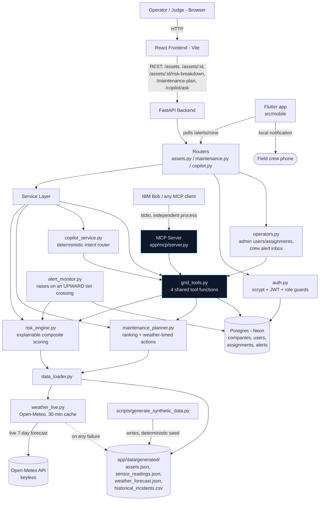

# Architecture

## System Architecture



**The one decision that matters most in this diagram:** `copilot_service.py`
(used by the web app's `/copilot/ask`) and `app/mcp/server.py` (used by IBM
Bob / any MCP client) both call into `grid_tools.py` — there is exactly one
implementation of "what counts as at-risk," not a UI version and a separate
Bob-demo version.

## Components

| Component | Technology | Responsibility |
|---|---|---|
| Frontend | React 19 + Vite + TypeScript + Tailwind CSS v4 + Recharts | Dashboard, asset detail, maintenance plan, Grid Copilot chat UI |
| Backend API | FastAPI + Uvicorn | REST endpoints, request validation (Pydantic), CORS |
| Risk Engine | Python (statistics module, no ML training) | Explainable composite risk scoring: sensor anomaly + weather risk + historical incident rate |
| Maintenance Planner | Python | Ranks by `risk_score × grid_impact_severity`, groups by region, times recommendations against weather forecasts |
| Grid Tools | Python | The 4 tool functions shared by the Copilot and the MCP server |
| Grid Copilot | Python (deterministic keyword/intent router) | Answers natural-language questions using real tool calls; zero dependency on a live LLM key |
| MCP Server | Python `mcp` SDK (`FastMCP`) | Exposes `get_at_risk_assets`, `get_asset_detail`, `explain_asset_risk`, `get_maintenance_plan`, `list_regions` to IBM Bob / any MCP client |
| Live Weather | Open-Meteo API (keyless) + `httpx`, 30-min cache | Real 7-day forecast per region; falls back to the seeded forecast on any failure |
| Operator layer | Postgres (Neon) via `psycopg` 3, raw SQL, no ORM | Companies, users, region assignments, alerts and acknowledgements — the people half of the system |
| Authentication | stdlib `hashlib.scrypt` + PyJWT | Email/password sign-in, JWT carrying `company_id` and `role`, `require_admin` on every admin route |
| Alert monitor | Background asyncio task | Raises an alert on an upward crossing into High/Critical; resolves on the way back down |
| Mobile client | Flutter + `flutter_local_notifications` | Crew inbox, acknowledgement, admin panel, device notifications with no Firebase project |
| Data Store | JSON/CSV files, loaded into memory at startup, dates re-anchored to today | Zero infrastructure, fully reproducible from a committed, re-runnable generator |
| Synthetic Data Generator | Python (stdlib only, seeded) | Deterministically produces internally-consistent assets, 30-day sensor series, 7-day weather forecasts, and historical incidents |

## Data Flow

1. `scripts/generate_synthetic_data.py` runs (once, or any time you want fresh
   data) and writes `assets.json`, `sensor_readings.json`,
   `weather_forecast.json`, and `historical_incidents.csv` under
   `src/backend/app/data/generated/`. It is seeded (`random.seed(42)`), so the
   same run always reproduces the same narrative: the top-ranked asset always
   has both a genuinely degrading sensor trend and an upcoming storm in its
   region.
2. On FastAPI startup, `data_loader.py` reads all four files into memory once
   (`@lru_cache`) and fails fast with a clear error if the data hasn't been
   generated yet. It then **re-anchors every date to today**
   (`_anchor_dates_to_today`): the generator writes absolute dates as of the
   day it ran, which on a deployed instance is *build* time, so without this
   the "7-day forecast" rots one day into the past per day since deploy and
   the app ends up warning about storms that already happened. One constant
   offset is applied to all three datasets, preserving their relative
   alignment exactly.
3. **Weather is then replaced with live data.** `data_loader.get_weather_forecast`
   asks `weather_live.py` for a real 7-day forecast from **Open-Meteo**
   (keyless), keyed on the centroid of that region's assets and cached for 30
   minutes, refreshed by a background task so no request ever waits on the
   network. Any failure — offline, timeout, non-2xx, malformed — falls back to
   the seeded synthetic forecast. Because every weather consumer in the app
   (risk engine, planner, MCP tools, Copilot, UI) reads through this one
   function, that single swap puts the whole system on live weather.
3. `risk_engine.py` computes, per asset: a sensor anomaly score per metric
   (z-score-style deviation of the last 3 days vs. that asset's own 15-day
   baseline, direction-aware), a **continuous** weather risk term, and a
   historical incident rate term (from the asset's age/type bracket) — summed
   into one 0-100 score with every component individually returned for the
   "Why This Score" UI.

   The weather term is deliberately **not** "storm somewhere this week → full
   points", which gave every asset in a region the same 25 points regardless
   of timing or condition. It scales with three things: how severe the worst
   forecast day is (wind gusts, precipitation probability, **and heat** —
   thermal derating on loaded equipment is a real failure driver the old
   binary model scored at zero), how soon that day is, and how vulnerable the
   specific asset is (ageing assets weighted up, N-1-redundant assets weighted
   down).
4. `maintenance_planner.py` ranks assets by `risk_score × grid_impact_severity`,
   groups the top N by region, and pulls each recommendation's target date
   forward to land before a forecast storm in that region.
5. The React frontend calls `/assets`, `/assets/:id`, `/assets/:id/risk-breakdown`,
   and `/maintenance-plan` to render the dashboard, asset detail, and
   maintenance plan views.
6. The Grid Copilot sends a question to `POST /copilot/ask`;
   `copilot_service.py` matches intent (region / asset / maintenance / risk
   keywords) and calls the matching function(s) in `grid_tools.py`, returning
   a grounded answer plus the list of tool calls that produced it — shown
   transparently in the UI.
7. Independently of the web app, `python -m app.mcp.server` starts an MCP
   server over stdio exposing the same `grid_tools.py` functions — see
   **Verifying the Bob/MCP integration** below.

## Verifying the Bob/MCP Integration

This is the concrete, judge-reproducible proof that IBM Bob integration is
load-bearing rather than name-dropped:

```bash
cd src/backend
.venv/Scripts/activate            # or source .venv/bin/activate
python -m app.mcp.server          # starts an MCP server over stdio
```

Connect any MCP client (or IBM Bob's MCP tool-calling) to this process and
call, for example:

```
get_at_risk_assets(region="Eastgate", min_tier="High", limit=3)
```

The returned `risk_score` values will exactly match what the dashboard shows
for those same assets in that region at `http://localhost:5173`, because both
paths call the same `app/services/grid_tools.py` functions. As a quick
sanity check without a full MCP client, the same guarantee can be verified
directly in Python:

```bash
python -c "
import asyncio, json
from app.mcp.server import mcp
from app.services import risk_engine

# What IBM Bob sees over MCP...
result = asyncio.run(mcp.call_tool('get_at_risk_assets', {'min_tier': 'Critical', 'limit': 3}))
over_mcp = [(a['asset_id'], a['risk_score']) for a in json.loads(result[0].text)['assets']]

# ...versus what the dashboard's /assets endpoint shows.
dashboard = [(a['asset_id'], a['risk_score'])
             for a in sorted(risk_engine.score_all_assets(), key=lambda a: -a['risk_score'])[:3]]

print('over MCP :', over_mcp)
print('dashboard:', dashboard)
assert over_mcp == dashboard, 'MCP and the UI disagree'
print('MATCH - one implementation, not two')
"
```

## The Operator Layer

The risk engine answers *what will fail*. The operator layer answers *who is
going to do something about it* — which is the half of "a prioritised
maintenance and crew pre-positioning plan" that a ranked list alone does not
deliver.

**Alerts fire on a crossing, not on a state.** `live_simulator` re-scores every
asset every 13 seconds. "Insert a row whenever tier == Critical" would produce
thousands of duplicates a day and train every crew member to mute the app.
`alert_monitor.py` stores each asset's last seen tier in `asset_tier_state` and
acts only on a transition — raise on the way up into High/Critical, escalate in
place on High→Critical, resolve on the way back down. Idempotency is enforced
twice on purpose: the loop compares tiers, *and* the database holds a partial
unique index allowing only one non-resolved alert per asset per company, so a
restart mid-loop cannot double-alert.

**Assignment is by scope, not by asset row.** `assignments(user_id, scope_type,
scope_value)` covers a whole region in one row (the only granularity that is
usable on a phone) or pins a single asset, in one table. An alert reaches
whoever holds the region; administrators see everything in their company.

**What is in Postgres, and what is not.** Only companies, users, assignments and
alerts. Assets, sensor series, weather and scoring stay in memory where they
already work — the two halves join on the `asset_id` string, which is stable
because the generator is seeded. If the database is absent the app still boots
and `/assets`, `/maintenance-plan`, `/copilot/ask` and the MCP server are
unaffected; only the operator routes return 503.

**The copilot can now act.** Signed in, it gains `get_my_alerts`,
`get_my_assignments`, `get_alert_detail` and `acknowledge_alert` — the first
tool in the project that mutates state. Identity is **overwritten** from the
JWT inside `_execute_tool`, never merged from the model's arguments, so an
injected instruction in a tool result cannot make it acknowledge another crew's
work. Anonymous sessions are offered only the original read-only tools, which
is what keeps the public web demo working with no account.

## Security Considerations

- All data is synthetic — no real customer, PII, or utility operational data
  anywhere in the repository.
- `.env` is git-ignored in both `src/backend/` and `src/frontend/`; only
  `.env.example` (no real values) is committed.
- No secrets are required for the MVP to run at all — the Grid Copilot's
  deterministic router needs no LLM API key. If one is ever added, it is read
  from an environment variable only, never hardcoded.
- CORS is restricted to the known frontend dev origin(s), not wildcarded.
- Passwords are stored as `hashlib.scrypt` digests with a per-user random salt,
  and compared with `hmac.compare_digest`. Never plaintext, never logged.
- **`company_id` always comes from the signed token, never from a path, query or
  body parameter.** A multi-tenant system that trusts a client-supplied tenant
  id is worse than a single-tenant one because it looks safe. This has a
  dedicated test (`tests/test_operators.py::test_a_company_cannot_see_another_companys_alerts`).
- Cross-tenant access fails as *not found*, not *forbidden* — a 403 would still
  confirm the row exists.
- `require_admin` is enforced server-side on every `/admin` route. Hiding a tab
  in the UI is not access control, and both clients treat their role-based
  navigation as convenience only.
- The login route returns one message for "no such account" and "wrong
  password", so it cannot be used to enumerate registered emails.
- `JWT_SECRET` is read from the environment. Unset, the app uses an ephemeral
  per-process key and says so — a visible nuisance, rather than the silent
  catastrophe of a hardcoded default anyone reading the repo could forge.
- The public read API (`/assets`, `/maintenance-plan`, `/copilot/ask`) is
  deliberately unauthenticated so the deployed demo works without an account;
  this is recorded as an explicit MVP boundary in `known_limitations`.

## Scalability Notes

The FastAPI backend is stateless per request and would scale horizontally
behind a load balancer without any code changes. The current bottleneck for
scale is the in-memory JSON data store and the fact that `risk_engine.py`
recomputes every asset's score on each `/assets` request; the natural next
step is to (a) swap the JSON files for a real time-series database (e.g.
TimescaleDB) behind the same `data_loader.py` interface, and (b) cache/
incrementally update risk scores instead of recomputing the full fleet per
request. Because `grid_tools.py` is the single interface both the REST API
and the MCP server depend on, neither of those changes would require
touching the API contract, the frontend, or the MCP server.
